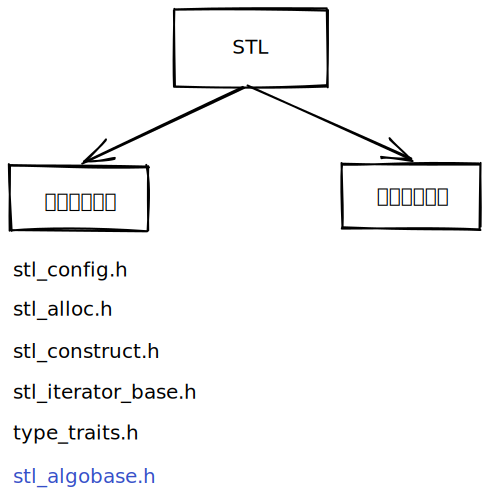

- [ ] 对`output_iterator_tag`的理解
- [x] 完成`stl_iterator_base.h`
- [ ] `__malloc_alloc_template`中对out-of-memory-handling的处理
- [ ] 研究__STL_USE_STD_ALLOCATORS被定义时的类继承关系





功能性头文件:

```
stl_config.h
stl_alloc.h
stl_iterator_base.h
stl_construct.h
stl_uninitialized.h
```

容器性头文件

```
stl_pair.h
stl_vector.h
...

```

### stl_iterator_base.h

```
# 五种迭代器类别类
struct input_iterator_tag;
struct forward_iterator_tag : public input_iterator_tag;
struct bidirectional_iterator_tag : public forward_iterator_tag;
struct random_iterator_tag : public bidirectional_iterator_tag
struct output_iterator_tag;


# 基础迭代器模板衍生出: 5中偏特化迭代器模板
template <...> class iterator;
template <...> class input_iterator;
template <...> class forward_iterator;
template <...> class bidirectional_iterator;
template <...> class random_iterator;
template <...> class output_iterator;

# 迭代器萃取器, 萃取出几种特性
template <...> class iterator_traits;

template <typename _Iter> iterator_traits::iterator_category;
template <typename _Iter> iterator_traits::value_type;
template <typename _Iter> iterator_traits::difference_type;
template <typename _Iter> iterator_traits::pointer_type;
template <typename _Iter> iterator_traits::reference_type;

# 函数advance(自增)和distance(距离)
template <typename _Iter> typename iterator_traits<_Iter>::difference_type \
    distance(_Iter first_, _Iter last_);

template <typename _Iter> void advance(_Iter iter_);

```

### stl_alloc.h

两种配置器: simple_alloc和malloc_alloc

```
typedef simple_alloc simple_alloc;

typedef malloc_alloc_template<0> malloc_alloc;
typedef malloc_alloc alloc;
typedef malloc_alloc single_client_alloc;
```


### stl_construct.h

```
template <typename _T1, typename _T2> construct(_T1*, _T2);
template <typename _T1> construct(_T1*);
template <typename _T1> destroy(_T1*);
template <typename _ForwardIterator> destroy(_ForwardIterator first_, _ForwardIterator last_);
```


enable_if
C++17之后，更推荐的用法是使用if constexpr，它不再需要将不同的特化拆分到不同的函数里，可读性更佳。
